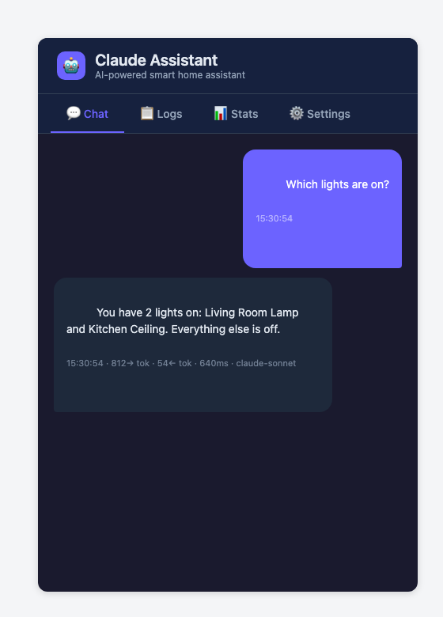
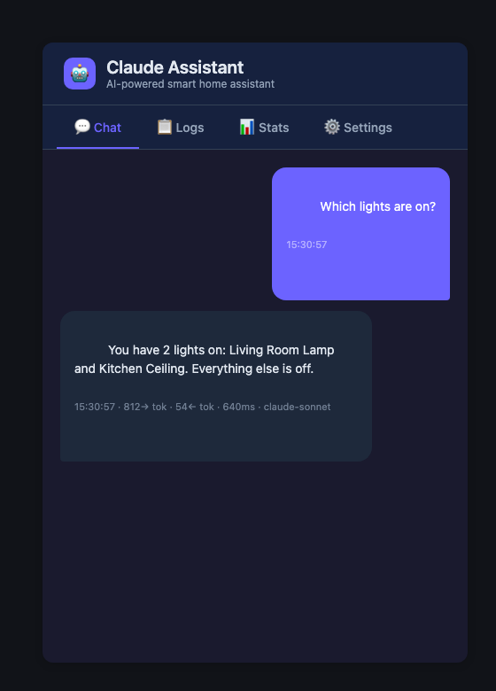

# Claude Assistant

Chat with Anthropic's Claude inside Home Assistant — as a sidebar panel and as
a selectable Assist conversation agent — with your live entity states fed in
as context automatically.

[](https://github.com/MacSiem/ha-claude-assistant/releases) [](https://www.home-assistant.io/) [](LICENSE)

> **What this version does — and doesn't — do:** Claude answers questions
> using a read-only snapshot of your entity states as context. It does
> **not** call Home Assistant services yet — the API client sends no
> function/tool definitions to Claude, so there is no code path today that
> turns a chat reply into a light turning on or a lock unlocking. The safety
> levels, dangerous-action list, and action-confirmation WebSocket commands
> exist in the codebase for a future tool-calling release, but nothing
> currently creates a pending action from a conversation. Treat this as a
> context-aware chat assistant, not (yet) a hands-on controller.

## How it works

1. **One config entry, one conversation agent.** Setup asks for an Anthropic
   API key (or an unsupported "personal account" option, see FAQ), a Claude
   model, and a default safety level. This registers a `conversation.*`
   entity that can be picked as the agent for a Voice Assistants pipeline.
2. **A sidebar panel ships automatically.** After restart, a **Claude
   Assistant** item appears in the sidebar (Chat / Logs / Stats / Settings
   tabs) — no Lovelace resource to add by hand.
3. **Entity states are injected into every request.** Before each API call,
   the integration builds a system prompt that includes a snapshot of your
   current entity states, so Claude can answer things like "which lights are
   on" without any extra configuration. Exactly what is included differs by
   code path — see [Privacy & data](#privacy--data).
4. **Conversation history is kept per code path.** The sidebar Chat tab and
   the Assist conversation agent each keep their own short rolling history
   (last ~20–40 exchanges) that is replayed to Claude on every message.

### What is automatic vs. manual

| Automatic | Manual |
|---|---|
| Conversation agent + sidebar panel registration | Entering your Anthropic API key during setup |
| Live entity-state context added to every message | Selecting Claude Assistant as the agent for a Voice Assistants pipeline |
| Local usage stats (tokens, conversation counts) and a log history | Picking model / temperature / max tokens / safety level / system prompt |
| WebSocket wiring for the sidebar panel | Actually confirming any action — there is currently nothing to confirm (see note above) |

## Entities

| Entity | Domain | Description |
|---|---|---|
| `conversation.claude_assistant` | `conversation` | One per config entry. Select it under Settings → Voice assistants → *(pipeline)* → Conversation agent to use Claude with Assist. `supported_languages` is `"*"` (all). |

Add only one Claude Assistant config entry: the integration keeps its shared
state (`api_client`, logs, stats, settings) in a single `hass.data` slot that
a second entry would overwrite, since the config flow does not block
duplicate entries.

## Services

| Service | Fields | Description |
|---|---|---|
| `claude_assistant.chat` | `message` (required) | Sends a one-off message to Claude using the sidebar panel's stored conversation history. The reply is **not** returned to the caller and no notification is created — it is only written to the integration's internal log and stats (visible in the sidebar panel's Logs/Stats tabs). |
| `claude_assistant.clear_history` | none | Clears the sidebar panel's in-memory conversation history. Does not affect the separate history kept by the Assist conversation agent entity. |

`services.yaml` in this repo also documents `send_message`, `execute_action`,
and `get_history` — those are not registered at runtime (only `chat` and
`clear_history` are); ignore them until a future release wires them up.

### Automation examples

```yaml
alias: Ask Claude for a morning summary
trigger:
  - platform: time
    at: "07:00:00"
action:
  - service: claude_assistant.chat
    data:
      message: "Give me a one-line summary of anything unusual in the home right now."
```

The reply isn't surfaced by the automation — open the **Claude Assistant**
sidebar panel's Logs tab afterwards to read it.

```yaml
alias: Reset Claude's chat memory nightly
trigger:
  - platform: time
    at: "00:00:00"
action:
  - service: claude_assistant.clear_history
```

## Screenshots

| Light | Dark |
|---|---|
|  |  |

*The Claude Assistant sidebar panel answering "Which lights are on?" using
live entity-state context. Dark mode here follows the browser/OS
`prefers-color-scheme`, not the Home Assistant theme — the panel does not
read `hass.themes`.*

## Installation

### HACS custom repository

1. Open HACS → Integrations → ⋮ → Custom repositories.
2. Add `https://github.com/MacSiem/ha-claude-assistant` with category
   `Integration`.
3. Install **Claude Assistant**.
4. Restart Home Assistant.
5. Go to Settings → Devices & services → Add integration → **Claude
   Assistant**.
6. Choose an auth method (use **Anthropic API Key**, see FAQ for why the
   other option is discouraged), paste the key, pick a Claude model, and
   pick a safety level.

A **Claude Assistant** sidebar item (visible to non-admin users too) appears
automatically after the entry is created — nothing else to configure for the
panel to show up.

The setup wizard's built-in text is Polish (`strings.json`); an English
translation is shipped in `translations/en.json` and is used automatically
for English-language instances. No other languages are translated yet.

## Quick start

Open **Claude Assistant** in the sidebar and start typing — try "Which
lights are on?" or "What's the state of the front door?". To use it with
voice, go to Settings → Voice assistants, open a pipeline, and set
**Claude Assistant** as the conversation agent.

## Privacy & data

This integration sends data to an external service — the Anthropic Claude
API (`api.anthropic.com`) — every time you send a message. There is no other
outbound network call in this codebase; no telemetry, analytics, or
MacSiem/HA Tools service is contacted.

**Exactly what is sent, per code path:**

- **Sidebar panel Chat tab** — your message text, up to the last 40 stored
  exchanges, and a system prompt that lists `entity_id: state` (no friendly
  names, no attributes) for entities in the `light`, `switch`, `climate`,
  `cover`, `lock`, `sensor`, `binary_sensor`, and `media_player` domains
  only, capped at the first 50 matched entities.
- **Assist conversation agent** — your message text, up to the last 20
  stored exchanges, and a system prompt that lists `friendly_name
  (entity_id): state` for **every** entity in your instance regardless of
  domain, capped at the first 100, plus the current value of
  `sensor.date_time_iso` if that entity exists.
- **Neither path sends entity attributes** (no coordinates, no exact sensor
  attribute values beyond the reported state string, no history, no device
  or network info).

**Where the API key lives:** in Home Assistant's own config-entry storage
(`.storage/core.config_entries`), the same place every other integration
keeps its credentials. It is read into memory only to authenticate requests
to the Anthropic API.

## FAQ

**Does this send my data anywhere?**
Yes — to Anthropic's Claude API, to generate replies. See
[Privacy & data](#privacy--data) above for the exact scope. Nothing else
leaves your instance.

**Can Claude actually control my devices?**
Not in this version. Claude only receives read-only entity-state text and
replies with text; the integration never gives Claude a way to call a
Home Assistant service. The `ActionHandler`, safety levels, and
`confirm_action`/`get_pending` WebSocket commands exist for a future
tool-calling release but aren't wired into any current chat path.

**What's the "Personal account (session key)" option in setup?**
It asks for a `sessionKey` cookie value from claude.ai and sends it to the
Anthropic API client exactly like an API key. A claude.ai web-session cookie
is not an Anthropic Console API key, and Anthropic doesn't document or
support this use — this path is unlikely to work. Use a real API key from
`console.anthropic.com/settings/keys` instead.

**Which Claude models can I pick, and what do they cost?**
`claude-opus-4-20250514` (default), `claude-sonnet-4-20250514`, and
`claude-haiku-3-5-20241022`, changeable any time from the integration's
Options or the sidebar panel's Settings tab. This integration does not
estimate or cap spend — every chat, Assist turn, or `claude_assistant.chat`
call is a normal Claude API request billed to your Anthropic account at
their standard per-token rate for the selected model. The sidebar Stats tab
tracks token and conversation counts locally to help you gauge usage, but it
does not show cost in currency.

**Is there a working Lovelace dashboard card?**
No. The repo bundles `card.js`/`confirmation-card.js`, but nothing registers
them as a Lovelace resource, and the bundled card's send button only
simulates a canned local reply rather than calling the real API. Use the
sidebar panel — it's the only wired-up UI in this release.

**My safety level says "dangerous only" — why didn't it ask me to confirm
anything?**
Because nothing in this release creates a pending action for it to confirm
(see "Can Claude actually control my devices?" above). The setting is stored
and shown in the panel, but has no effect yet.

## Changelog

See [CHANGELOG.md](CHANGELOG.md) and the
[GitHub Releases](https://github.com/MacSiem/ha-claude-assistant/releases)
page for release notes.

## Support

If this tool makes your Home Assistant life easier, consider supporting
development:

<a href="https://buymeacoffee.com/macsiem" target="_blank"></a>
<a href="https://www.paypal.com/donate/?hosted_button_id=Y967H4PLRBN8W" target="_blank"></a>

## License

MIT — see [LICENSE](LICENSE).
